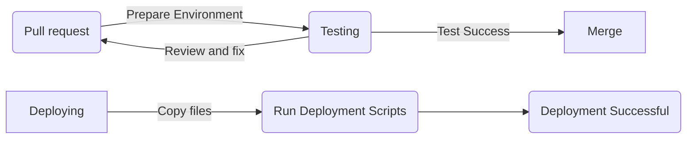

## Short summary
NC News Backend is the server-side part of a Reddit-like news app. It's built with Node.js and PostgreSQL. This guide helps you set up the backend on your computer. It includes steps for installing, setting up databases, and running the app. The backend lets you manage articles, comments, and user data through API endpoints

## Documentation
Documentation can be found at [Link](https://krasen.site/api/docs)

## Prerequisites

Before you begin ensure you have the following installed:

| Requirement | Minimum version |
| --- | --- |
| Node.js | >= v16.20.2 |
| PostgreSQL | >= 14.9 |
| Docker | Latest version |

 

## Installing

A step by step series of examples that tell you how to get environment running.

#### Clone the repository:

- ##### ssh: ```git clone git@github.com:krasenHristov/nc-news.git```


- ##### https: ```git clone https://github.com/krasenHristov/nc-news.git```

#### Install NPM packages:

```
npm install
```

## Docker setup
To run the application using Docker you need to build a Docker image and then run it as a container

#### To build the image:
 ```
docker build -t nc-news .
```

#### To run the application as a container:
- Replace ```<port>``` with desired port
```
docker run -p <port>:<port> nc-news
```

## Continuous Integration and Deployment (CICD)
The project is configured for CI/CD using GitHub Actions. When a pull request is created, the pipeline automatically runs a series of automated tests. If the tests pass, the pull request can be merged into the main branch. Once changes are pushed to the main branch, the application is automatically deployed to AWS.




# Set up
## Setting Up Environment Variables

Since .env.test and .env.development are not tracked by Git, you'll need to create these files manually to connect to the databases locally.

### For Local Development
- #### Create a .env.test file

This file should contain environment variables for your test environment.
Add the following line to the file:

```
PGDATABASE=nc_news_test
```

This sets the PostgreSQL database to nc_news_test for your test environment.

- #### Create a .env.development file

This file should contain environment variables for your development environment.
Add the following line to the file:

```
PGDATABASE=nc_news
```

This sets the PostgreSQL database to nc_news for your development environment.
Ensure that these files are located in the root directory of your project.

### For Production
- #### Create a .env.production file
This file should contain the URL to your hosted database.
Add the following line to the file:
```
DATABASE_URL=<your_database_url>
```

## Running the Application

- ### To create databases and seed them
```
npm run setup-dbs
npm run seed
```

- ### To run the application in development mode, use:

```
npm run dev
```

- ### For running tests:

Run the tests:
```
npm test
```
Each test suite will reseed the database and log in a test user before running the tests
